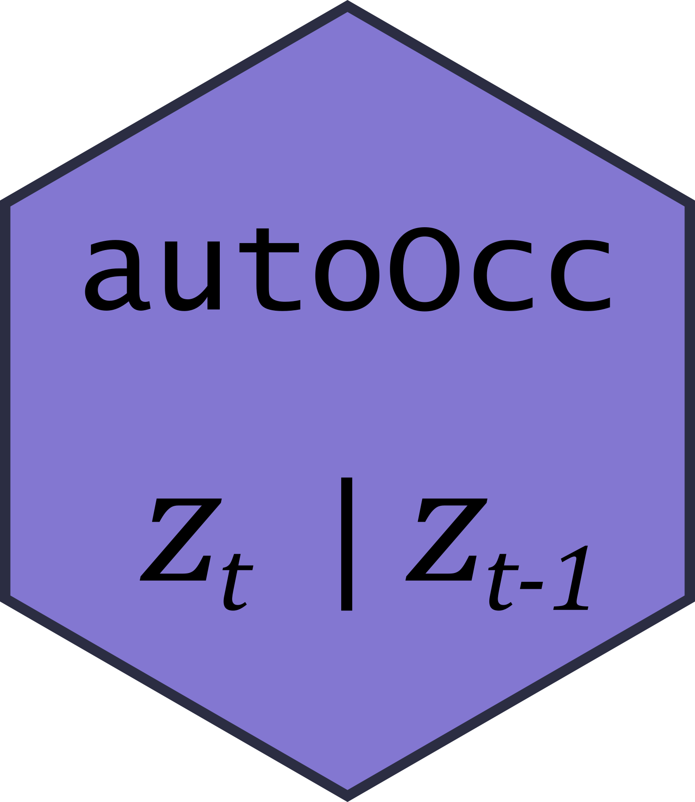
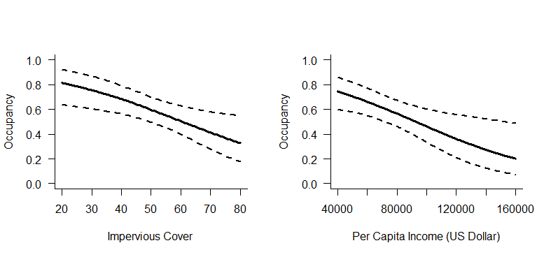

<!-- badges: start -->
[](https://codecov.io/gh/mfidino/autoOcc?branch=main)
[](https://github.com/mfidino/autoOcc/actions)
<!-- badges: end -->

# autoOcc 0.1.0
 
`autoOcc` is an R package to fit an autologistic occupancy model, which is a simplified version of a dynamic occupancy model that is espcially useful when dealing with smaller datasets. `autoOcc` fits this model hierarchically so that different covariates can be used on a species latent occupancy and detection probability. Most of the functions here behave similarly to those in `unmarked`, so using `autoOcc` should be somewhat familar to those who have experience with that R package.


## Status: Experimental, active developement

---

This package is in active development. I'll likely just add in new functions
when I locate some pain points while working with it. That said, the current
functions are stable.

## Installation

---

`autoOcc` can be installed from Github:

```R
install.packages("devtools")
devtools::install_github(
  "mfidino/autoOcc",
  build_vignettes = TRUE
)

```


## Author Contributions

---

Mason Fidino is the sole contributing author of `autoOcc`, though some of the code used in this package was based on the code and analysis flow of `unmarked`.

If you are interested in contributing, see [Contributor Guidelines](CONTRIBUTING.md).

## Overview vignette

If you want a more thorough walkthrough of a standard analysis in `autoOcc`,
and had made certain to build the vignettes when installing from github,
check out the overview vignette with:

```R
vignette("Overview")
```

## Example analysis

---

```R

library(autoOcc)
# load in the data
data("opossum_det_hist")
data("opossum_covariates")

# function to generate detection history
#  for the opossum data, opossum_y is
#  a site by primary sampling period by secondary 
#  sampling period array.
opossum_y <- autoOcc::format_y(
  x = opossum_det_hist,
  site_column = "Site",
  time_column = "Season",
  history_columns = "^Week" # start with Week
)
# scale the covariates for analysis
oc_scaled <- as.data.frame(
  lapply(
    opossum_covariates,
    function(x){
      if(is.numeric(x)){
        scale(x)
      }else{
        x
      }
    }
  )
)
# dropping site column from oc_scaled
oc_scaled <- oc_scaled[,-1]

# suppress warnings because opossum_y has sites
#  with no data, will return warning because some
#  sites have no data.
m1 <- auto_occ(
    ~Impervious + Income  ~ Impervious + Income,
    y = opossum_y,
    det_covs = oc_scaled,
    occ_covs = oc_scaled
)

m2 <- auto_occ(
  ~Impervious~Impervious,
  y = opossum_y,
  det_covs = oc_scaled,
  occ_covs = oc_scaled
)
m3 <- auto_occ(
  ~Income~Income,
  y = opossum_y,
  det_covs = oc_scaled,
  occ_covs = oc_scaled
)
m4 <- auto_occ(
 ~1~1,
 y = opossum_y,
 det_covs = oc_scaled,
 occ_covs = oc_scaled
)

# compare models
my_aic_results <- compare_models(
  list(m1, m2, m3, m4),
  digits = 2
)

# Looks like the first model, which included
#  income and impervious cover, is the best
#  fit model. 

#   model npar     AIC delta AICwt cumltvWt
# 1    m1    7 1232.72  0.00  0.90     0.90
# 2    m3    5 1238.22  5.50  0.06     0.96
# 3    m4    3 1239.66  6.94  0.03     0.99
# 4    m2    5 1241.14  8.42  0.01     1.00

# Let's make predictions from this model.
# First, I make the prediction data.frame with a realistic
#   range based on the actual data and not the scaled data.
#   The range(oc$Impervious) is about 18 to 81, so choose 20
#   to 80. We do this so that we have nice numbers for plotting.
#   Likewise, we scaled all of the other data, so we leave Income
#   at it's mean (i.e., 0) for predictions.
imperv_real <- data.frame(
  Impervious = seq(20,80,0.5),
  Income = 0
)
# We will use imperv_real for plotting purposes, but to make predictions
#  we need to scale imperv_real$Impervious in the exact same way we did
#  with the fitted model. Thus, we subtract the mean of the actual data
#  and divide by the standard deviation.
imperv_scaled <- imperv_real
imperv_scaled$Impervious <- (
  imperv_scaled$Impervious - mean(opossum_covariates$Impervious)
) / sd(opossum_covariates$Impervious)
# the model prediction across a gradient of Impervious cover
opo_imperv <- predict(
  object = m1,
  type = "psi",
  newdata = imperv_scaled
)
# do the same thing with income
income_real <- data.frame(
  Impervious = 0,
  Income = seq(40000, 160000, by = 500)
)
income_scaled <- income_real
income_scaled$Income <- 
  (income_scaled$Income - mean(opossum_covariates$Income))/
  sd(opossum_covariates$Income)
opo_income <- predict(
  object = m1,
  type = "psi",
  newdata = income_scaled
)
# plot them out
par(mfrow = c(1,2))
plot(
  opo_imperv$estimate ~ imperv_real$Impervious,
  bty = "l",
  type = "l",
  las = 1,
  ylab = "Occupancy",
  xlab= "Impervious Cover (%)",
  ylim = c(0,1),
  lwd = 3
)
lines(opo_imperv$lower ~ imperv_real$Impervious, lwd = 2, lty = 2)
lines(opo_imperv$upper ~ imperv_real$Impervious, lwd = 2, lty = 2)
plot(
  opo_income$estimate ~ income_real$Income,
  bty = "l",
  type = "l",
  las = 1,
  ylab = "Occupancy",
  xlab= "Per Capita Income (US Dollar)",
  ylim = c(0,1),
  lwd = 3
)
lines(opo_income$lower ~ income_real$Income, lwd = 2, lty = 2)
lines(opo_income$upper ~ income_real$Income, lwd = 2, lty = 2)

```



